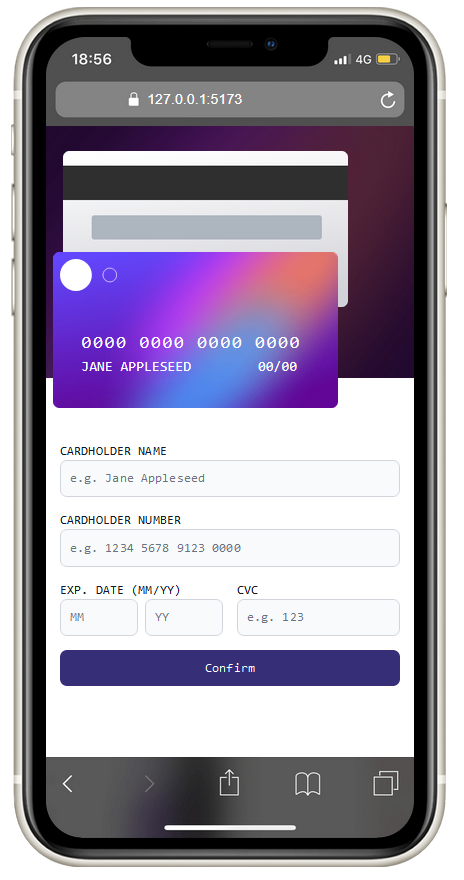
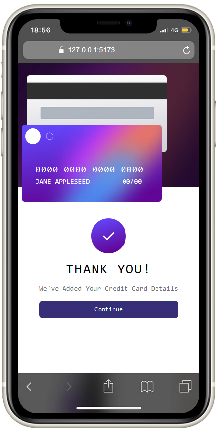
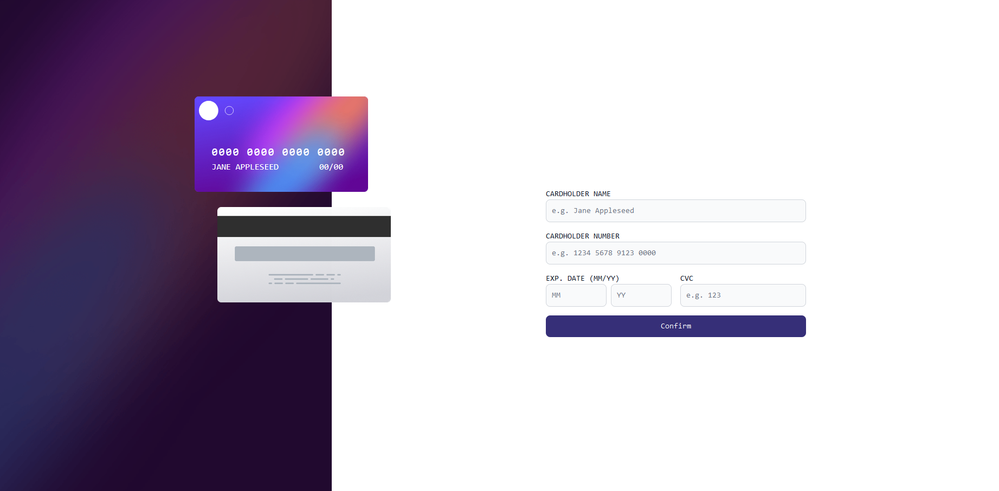

# Overview

This is a responsive Credit Card Page - a coding challenge from [`Front-End Mentor`](https://www.frontendmentor.io)
Built using SvelteKit, powered by [`create-svelte`](https://github.com/sveltejs/kit/tree/master/packages/create-svelte), Tailwind CSS and Flowbite-Svelte.

## Features

- Responsive layout
- Position Layout
- Form conditional render

## Images

